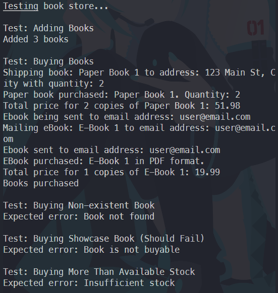

# Fawry Task 2 - Quantum Bookstore

A simple book inventory management system built in Java for the Fawry summer internship program.

## What it does

- Manages different types of books (paper books, ebooks, showcase books)
- Handles purchasing with stock validation
- Sends ebooks via email and ships paper books to addresses
- Showcase books are display-only and can't be purchased

## Running the code

The main test class is `TestClass.java` - just run it to see the system in action.

## Structure

- `models/` - Book classes (Book, PaperBook, EBook, ShowcaseBook)
- `services/` - Business logic (InventoryService, ShippingService, MailService)
- `interfaces/` - Buyable interface for purchasable items

